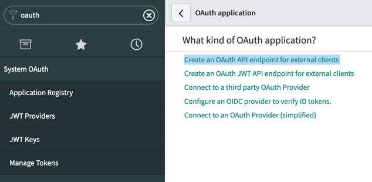
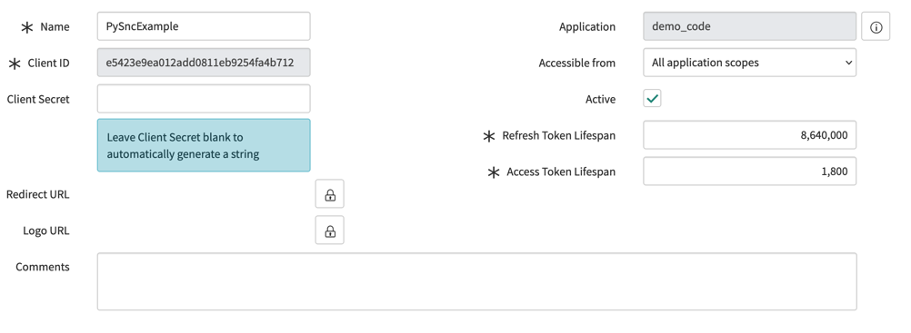

.. _authentication:

Authentication
==============

Basic Authentication
--------------------

Standard BasicAuth, every request contains your username and password base64 encoded in the request header. The most
insecure, but simplest, way to authenticate. Remember to scope the user's ACLs to the minimum if using with automations.

    >>> client = pysnc.ServiceNowClient('dev00000', ('admin','password'))

This is not recommended for any production or machine to machine activity as there are much better options.

HMAC and API Key Authentication
----------------------

New to Washington DC -- See the [HMAC and API Key Authentication](https://docs.servicenow.com/bundle/washingtondc-platform-security/page/integrate/authentication/concept/api-key-and-hmac-rest-apis.html) documentation for more information on how to configure/set this up. API Access policies are as follows:

* Table API - required (use `latest` as we do not use the versioned URLs)
* Batch API - optional (use `v1` :ref:``) if you use batch operations such as `update_multiple`
* Attachment API - optional (use `v1`) if you use any attachment functionality

For API key (it is recommended you use HMAC over this, as it is more secure):

    >>> from pysnc import ServiceNowClient
    >>> from pysnc.auth import ServiceNowAPIKey
    >>> api_key = '...' # never store this in plaintext, anywhere
    >>> client = ServiceNowClient(server_url, ServiceNowHMACAuth(api_key))

For HMAC:

    >>> from pysnc import ServiceNowClient
    >>> from pysnc.auth import ServiceNowHMACAuth
    >>> shared_secret = '...' # never store this in plaintext, anywhere
    >>> client = ServiceNowClient(server_url, ServiceNowHMACAuth(shared_secret))

OAuth2 - Password Grant Flow
----------------------------

OAuth2 password flow is currently supported and recommended

    >>> from pysnc import ServiceNowClient
    >>> from pysnc.auth import ServiceNowPasswordGrantFlow
    >>> client_id = 'ac0dd3408c1031006907010c2cc6ef6d' # oauth_entity.client_id
    >>> secret = '...' # oauth_entity.client_secret
    >>> auth = ServiceNowPasswordGrantFlow(username, password, client_id, secret))
    >>> client = ServiceNowClient(server_url, auth)

This will use a users credentials to retrieve and store an OAuth2 auth and refresh token, sending your auth token with
every request and dropping your user and password from memory. This will automatically update your access tokens.

To configure this flow, create a new OAuth Application by selecting a new OAuth API endpoint:

Name it, save/insert it, and note your new client_id and client_secret. This flow is sometimes called a Legacy flow, as it
is not the ideal method OAuth usage. In this flow it is tolerable to share/embed your client_secret.

OAuth2 - Auth Code Grant Flow
-----------------------------

No instructions, currently. Typically what you would want to use if you're a client doing things on behalf of users.

OAuth2 - Client Credential Grant Flow
-------------------------------------

ServiceNow does not support this OAuth flow as it is not a provider.

OAuth2 - JWT Bearer Grant Flow
------------------------------

Create a new `JWT Provider <https://docs.servicenow.com/en-US/bundle/tokyo-platform-security/page/administer/security/task/create-jwt-endpoint.html>`_
and use it with whomever generates your JWT tokens. Once you have your JWT you may use it to request a Bearer token for
standard auth:

    >>> auth = ServiceNowJWTAuth(client_id, client_secret, token)
    >>> client = ServiceNowClient(self.c.server, auth)

Wherein client_id and client_secret are the `oauth_jwt` record entry values and `token` is the JWT generated by your provider.

The token contains who are are logging in as - as such the PySNC library does not attempt to act as a provider. We do however
have an example of how that is done in the tests.

mTLS - Mutual TLS Authentication (Certificate-Based Authentication)
-------------------------------------------------------------------

The most ideal form of authentication for machine to machine communication. Follow `KB0993615 <https://support.servicenow.com/kb?id=kb_article_view&sysparm_article=KB0993615>`_ then:

    >>> client = ServiceNowClient(instance, cert=('/path/to/client.cert', '/path/to/client.key'))

Requests Authentication
-----------------------

Ultimately any authentication method supported by python requests (https://2.python-requests.org/en/master/user/authentication/) can be passed directly to ServiceNowClient.

Should be flexible enough for any use-case.

Storing Passwords
-----------------

The keystore module is highly recommended. For example::

    import keyring

    def check_keyring(instance, user):
        passw = keyring.get_password(instance, user)
        return passw

    def set_keyring(instance, user, passw):
        keyring.set_password(instance, user, passw)

    if options.password:
        passw = options.password
        set_keyring(options.instance, options.user, passw)
    else:
        passw = check_keyring(options.instance, options.user)
        if passw is None:
            print('No Password specified and none found in keyring')
            sys.exit(1)

    client = pysnc.ServiceNowClient(options.instance, ...)
